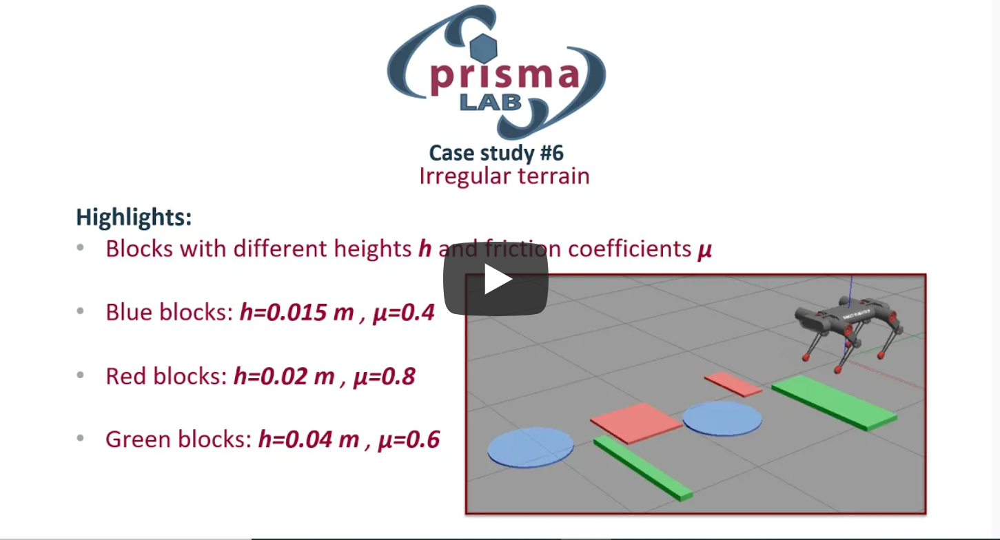

# A whole-body controller with disturbance rejection through a momentum-based observer for quadruped robots

This software allows simulating the locomotion of a quadruped robot through a Whole-Body Control presented in the paper:

*V. Morlando,  A. Teimoorzadeh, [F. Ruggiero](http://www.fabioruggiero.name/web/index.php/en/), "[Whole-body control with disturbance rejection through a momentum-based   observer for quadruped robots](http://www.fabioruggiero.name/web/files/Papers/J19.pdf)", Mechanism and Machine Theory, (in press), 2021, DOI:   buildUrl('10.1016/j.mechmachtheory.2021.104412') .*

  

The combination of a motion planner for the trajectory of the robot’s center of mass, a momentum-based observer estimator, and an optimization problem based on the modulation of ground reaction forces allows the robot to reject external disturbances.

The repository contains the following elements:
 * A quadruped robot model  already implemented inside the Gazebo simulator;
 * A plugin to simulate external forces stressing the robot;
 * A scene reproducing an irregular terrain;
 * Some examples to test the proposed controller.

