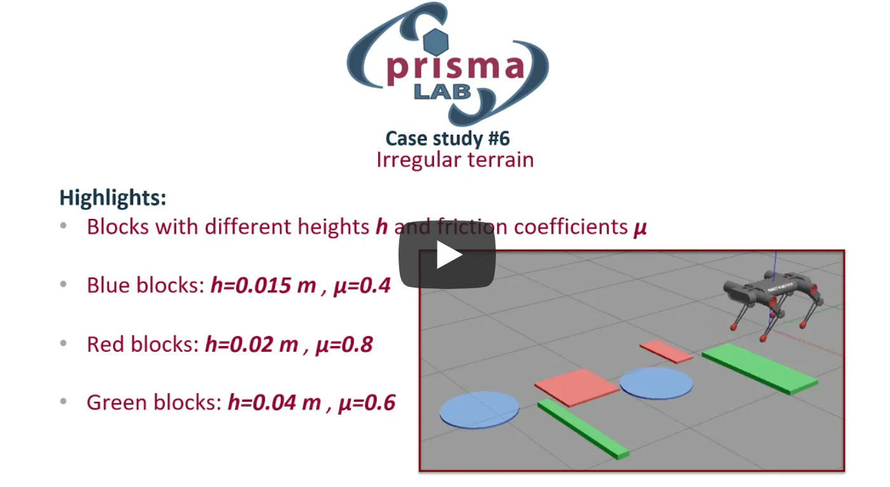

# A whole-body controller with disturbance rejection through a momentum-based observer for quadruped robots

This software allows simulating the locomotion of a quadruped robot through a Whole-Body Control presented in the paper:

*V. Morlando,  A. Teimoorzadeh, [F. Ruggiero](http://www.fabioruggiero.name/web/index.php/en/), "[Whole-body control with disturbance rejection through a momentum-based   observer for quadruped robots](http://www.fabioruggiero.name/web/files/Papers/J19.pdf)", Mechanism and Machine Theory, (in press), 2021, DOI:   10.1016/j.mechmachtheory.2021.104412 .*


  [](https://www.youtube.com/watch?v=styHnKxOot8)


The combination of a motion planner for the trajectory of the robot’s center of mass, a momentum-based observer estimator, and an optimization problem based on the modulation of ground reaction forces allows the robot to reject external disturbances.

The repository contains the following elements:
 * A quadruped robot model  already implemented inside the Gazebo simulator;
 * A plugin to simulate external forces stressing the robot;
 * A scene reproducing an irregular terrain;
 * Some examples to test the proposed controller.


### Citing
```
@article{MorlandoMAMT2021,
  title={Whole-body Control with Disturbance Rejection through a Momentum-based Observer for Quadruped Robot},
  author={Morlando, Viviana and Teimoorzadeh, Ainoor and Ruggiero, Fabio },
  journal={Mechanism and Machine Theory (in press)},
  volume={164},
  year={2021},
  publisher={Elsevier}
}
```

# Instructions

The code was tested with Ubuntu 18.04, and ROS Melodic. Different OS and ROS versions are possible but not supported.

### Install dependencies

`sudo apt-get install ros-melodic-ros-control ros-melodic-ros-controllers`

### Clone the following packages 

```cd <CATKIN_WS_DIR>/src```

`git clone https://github.com/prisma-lab/WBC_quadruped_DOB/tree/main/dogbot_controller`

`git clone https://github.com/prisma-lab/WBC_quadruped_DOB/tree/main/DogBotV4`

`git clone https://github.com/prisma-lab/WBC_quadruped_DOB/tree/main/force_plugin`


### Compile 

`catkin_make`

### Run simulation
Choose the case study inside force_plugin.cpp

`roslaunch dogbot_gazebo gztest.launch paused:=true`

`rosrun dogbot_controller dogbot /yourpath/<CATKIN_WS_sir>/src/DogbotV4/ROS/src/dogbot_description/urdf/dogbot.urdf`

Press play in gazebo to start the simulation


